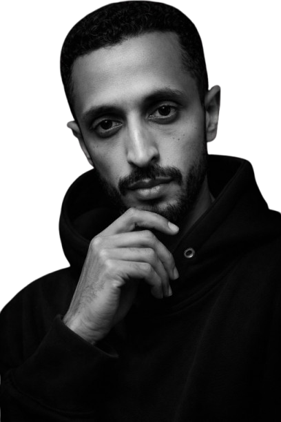

# Arik - Premium Dark Luxury Portfolio

A sophisticated personal portfolio website built with **Laravel 11**, designed for creative professionals, developers, and digital marketers who value high-end aesthetics and seamless user experience.



## ✨ Key Features

-   **Dark Luxury Aesthetic:** Meticulously crafted UI with a gold-on-black color palette.
-   **Smooth Scrolling:** Integrated with **Lenis** for a silky-smooth browsing experience.
-   **Dynamic Animations:** Powered by **GSAP** and **ScrollTrigger** for elegant reveal and parallax effects.
-   **Multi-language Support:** Full RTL/LTR support for **Arabic** and **English**.
-   **Fully Responsive:** Optimized for all devices, from ultra-wide monitors to mobile screens.
-   **SEO Optimized:** Dynamic meta tags, Open Graph support, and semantic HTML.
-   **CMS Ready:** Powered by a clean Laravel backend for managing Services, Works, and Blog Posts.

## 🛠️ Tech Stack

-   **Backend:** Laravel 11 (PHP 8.2+)
-   **Frontend:** Tailwind CSS, Alpine.js
-   **Animations:** GSAP, ScrollTrigger, Lenis (Smooth Scroll)
-   **Database:** SQLite/MySQL
-   **Icons:** Heroicons (Custom SVG implementations)

## 🚀 Getting Started

### Prerequisites
- PHP 8.2 or higher
- Composer
- Node.js & NPM

### Installation

1. **Clone the repository:**
   ```bash
   git clone https://github.com/abood7303/personal-website.git
   cd personal-website
   ```

2. **Install dependencies:**
   ```bash
   composer install
   npm install
   ```

3. **Environment Setup:**
   ```bash
   cp .env.example .env
   php artisan key:generate
   ```

4. **Database Migration & Seeding:**
   ```bash
   php artisan migrate --seed
   ```

5. **Run the development server:**
   ```bash
   npm run dev
   php artisan serve
   ```

## ✒️ Author
**Abdulrahman Ahmed**
*Creative Developer & Digital Marketer*

---
Made with ❤️ by Abdulrahman.
